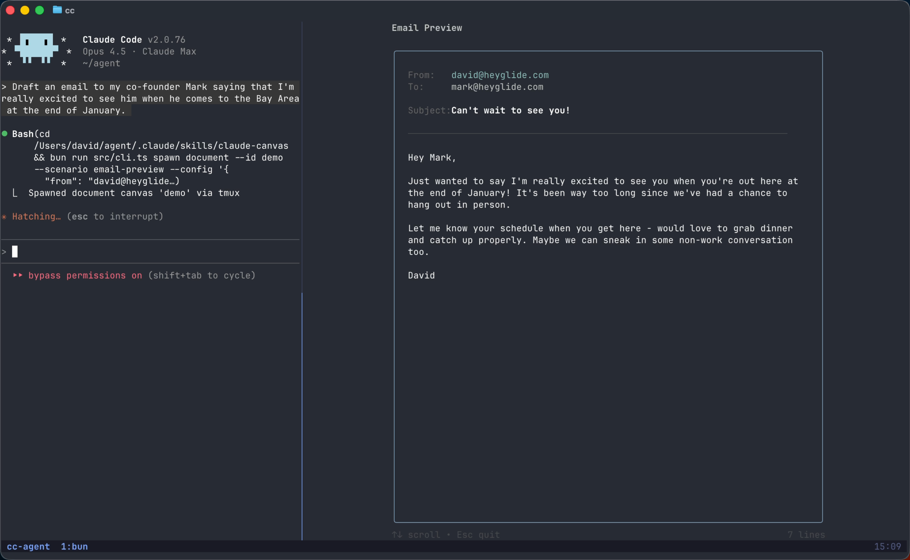

# Claude Canvas

A TUI toolkit that gives Claude Code its own display. Spawn interactive terminal interfaces for emails, calendars, flight bookings, and more.



## Installation

Add this repository as a marketplace in Claude Code:

```
/plugin marketplace add dvdsgl/claude-canvas
```

Then install the canvas plugin:

```
/plugin install canvas@claude-canvas
```

## License

MIT
